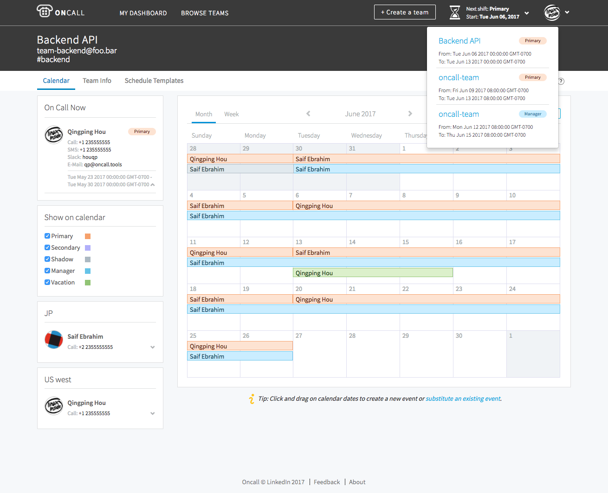

.. Oncall documentation master file, created by
   sphinx-quickstart on Mon May  1 10:06:23 2017.
   You can adapt this file completely to your liking, but it should at least
   contain the root `toctree` directive.

Welcome to Oncall's documentation!
==================================

Oncall_ is a calendar tool designed for scheduling and managing on-call shifts.
It is a standalone application that serves as source of truth for dynamic
ownership information as well as contact info.

.. _Oncall: http://oncall.tools
.. _Iris: http://iris.claims

At linkedin, we use Oncall together with our open-source escalation and
messaging system Iris_. The combination of the two provide a way to manage
on-call schedules and ensure that the person scheduled as on-call at a given
time is notified of any issues.

.. toctree::
   :maxdepth: 2
   :caption: Table of contents

   user_guide
   admin_guide
   api

Indices and tables
==================

* :ref:`genindex`
* :ref:`modindex`
* :ref:`search`
