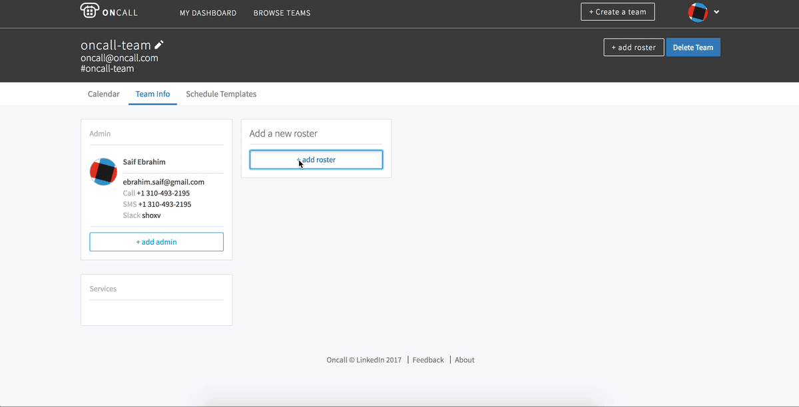
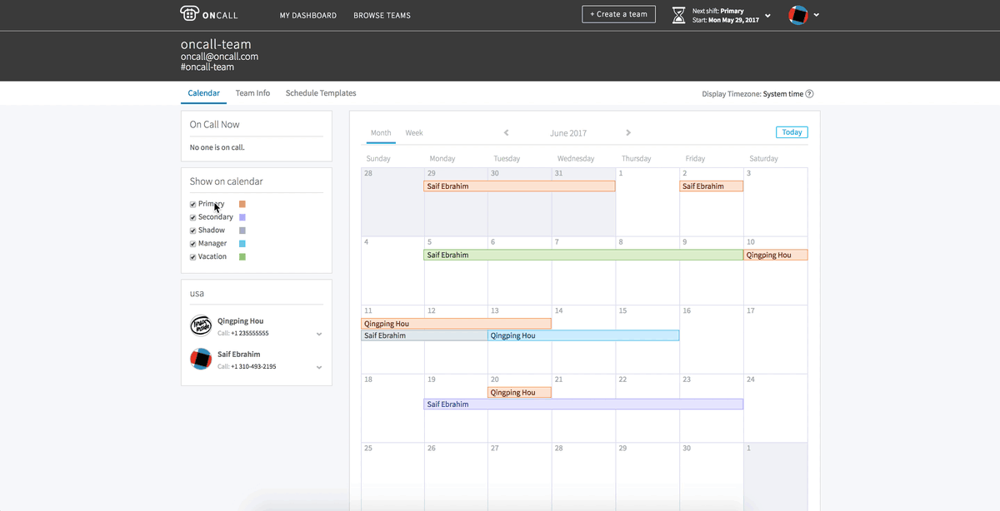

.. _user-guide:

User guide
==========

Home page
---------

Search
``````

The search page allows you to search for either teams or services. Clicking on a
service will take you to the landing page of the team which owns the service.


Most Recently Viewed
````````````````````

The recently viewed module will list a summary of up to the last 6 teams you
visited.


Teams
-----

The team page provides all view and edit functionality for all the teams
available in the Oncall database. Team information can only be managed and
edited by team administrators.

To create a new team, simply hit the 'Create a team' button in the header, fill
out the team information, and you will be redirected to the team information
page where you can manage your team.

.. image:: _static/create-team.gif
    :width: 100%
    :align: center
    :alt: create Oncall team

.. NOTE::
   The "Team Scheduling Timezone" field will determine what timezone the
   scheduler uses when creating events. It is independent from the user timezone in
   the settings page, which is only effects viewing and creating events on the
   calendar page.


Teams Info
----------

The team info page displays the Admins, Rosters, and Services associated with
the team. This is also where all team management functions exist. If you are an
administrator for the team, you will see these actions on the page, otherwise
you will see a view-only version of the page.

You can edit the team information by clicking on the pencil icon on the
subheader next to the team name.

.. image:: _static/update-team.gif
    :width: 100%
    :align: center
    :alt: edit Oncall team


Admins
``````

This module is for admin management. Anyone added as an admin will have full
privileges to manage the team.


Services
````````

You can link services to your team here. One service can only be linked to one
team. Linking a service here will show your team as the result when users search
for the service.

.. TODO: link service screenshot

Rosters
```````

Called rotations in the previous Oncall, here you can divide your teams into
smaller groups which the scheduler will cycle through when creating the events.
You can also mark users out of rotation here so the scheduler ignores them when
creating events. Clicking the trash can next to the user will remove that user
from rotation, and clicking the trash can at the top right of the roster will
delete the roster entirely.




Teams Calendar
--------------

The calendar page is the landing page for a team and serves as an overview for
the team and their schedule. It is also where all event interaction is managed.

Calendar
````````

The calendar module displays the events generated by the scheduler, along with
custom events added through the calendar. You can hover over or click on an
event to get more details.

Add Calendar Events
~~~~~~~~~~~~~~~~~~~

.. NOTE::
   The API currently restricts adding events in the past.

To add a new event to the calendar, you can click or click and drag on any
whitespace within the calendar date blocks. This will display a modal with
options for the new event:

User
  Username of the user this event will be associated with. NOTE: You can only
  add users which are part of the team as an admin or a roster.

Start / End Date
  Defaults to the selection made while clicking and dragging. The date expects a
  YYYY/MM/DD Format, and time expects 24 hour time in a HH:MM format.

Role
  Choose from a list of available roles.

Substitute
  Event substitution can be used to replace an existing event with your new
  event. See Substitute / Override Events for more information.

.. image:: _static/create-event.gif
    :width: 100%
    :align: center
    :alt: add calendar events


Substitute / Override Events
~~~~~~~~~~~~~~~~~~~~~~~~~~~~

You can use event substitution to replace existing events. To do this, start by
clicking and dragging on the calendar as if you were creating a new event,
adjust the settings for your event, then check the 'substitute' toggle.
Toggling this option on will display a list of event[s] which match the criteria
selected. Check the event[s] you want to substitute, and Oncall will override
those events and split the selected event[s] for you ( if the selected event[s]
extend beyond the new event you are creating ).

.. image:: _static/substitute-events.gif
    :width: 100%
    :align: center
    :alt: substitute calendar events


Event Details
~~~~~~~~~~~~~

Clicking on an event in the calendar will bring up a modal with the details of
the event. The top right has SWAP and EDIT actions which can be used for event
management. Per user requests, these actions can be used by anyone on the team
and do not require admin privileges.


Event Details.Edit
__________________

In this view, you are able to edit any of the event details, or delete the event
entirely.


Event Details.Swap
__________________

The swap view lets you swap the event you clicked with another event that have
not already started. Swap essentially is just changing the owner of the 2
events, everything else about the event remains identical. The event swap modal
has the following opions:

From
  These details are populated from the event you clicked.

To
  This is the event you want to swap with. There are 2 filters provided to help
  you find the event you are looking to swap with.  Currently, you are able to
  swap with events of varying types ( so go ahead and swap your primary on call
  shift with a teammate's vacation ), though we may restrict this in the future.

.. image:: _static/swap-events.gif
    :width: 100%
    :align: center
    :alt: swap calendar events


Show On Calendar
````````````````

This module lists all the available types of roles on the calendar, their colors
associated with each role, as well as the option to hide / show that event type
on the calendar.




On Call Now
```````````

Lists the primary Oncalls currently, as well as the current manager on duty.
This module does not display shifts other than primary and manager. You can
click on the caret to hide/show contact information.


Rosters
```````

These modules display the rosters for the team with the associated users, along
with which users are marked out of rotation. You can click on the caret to
hide/show contact information.


Teams Schedules
---------------

The schedules page is used to manage the templates which the scheduler uses to
generate the events you see on the calendar ( outside of custom events ).

Currently the scheduler runs every hour and will generate schedules 3 weeks out,
by default. Auto-scheduler preferences from the old version of Oncall have been
preserved as well. Thus, if a team chose to populate N weeks into the future in
the old Oncall, the new oncall will also populate N weeks into the future,
unless a new schedule has been created. This setting will become configurable in
an upcoming release.

Currently, the scheduler prioritizes users who haven't been on-call for the
longest period of time. It respects conflicting events on the team's calendar as
well (e.g. it will not schedule someone to be on-call if that user has a
vacation marked). The scheduler chooses its start date based on the last event
that it scheduled. This may create confusing behavior if users manually delete a
scheduled event and replace it with a new one. In this case, the scheduler will
double-up shifts, believing a hole in the schedule has been created. This
behavior was created in response to the previous scheduler's behavior, which
began starting at the last event on the calendar and tended to create holes in
the schedule. In an upcoming release, the scheduler's start time will become
user-configurable, allowing users to decide the exact date that the scheduler
beings to populate events.

It prioritizes users that haven't been on call the longest. These settings will
become configurable in an upcoming release.


Schedule
````````

Click the new schedule button to open the new schedule widget:

Roster
  The scheduler will create events with the users in the selected roster.

Start
  Previously handoff time, this is the time the event will run from and to.  The
  time expects 24 hour time in a HH:MM format.

Role
  Role of the events.

Rotate
  This is the length of each event generated by the scheduler.

Scheduling Timezone
  This is the timezone set at a team level that the scheduler will use to create
  events. This is independent from the timezone in user settings and is set for
  the team regardless of what timezone you're in.

Preview
  This button will visualize the schedule on the calendar.


Schedule.Advanced
~~~~~~~~~~~~~~~~~

The advanced mode gives you more control allowing for more custom schedules to
be created.

Duration
  Expects an integer and unit. Defines the length of each event generated by the
  scheduler.

Add another row
  You can add and remove rows to customize your schedule further.


Settings
--------

These settings are managed through Cinco/LDAP, except for display timezone.
Changing the display timezone will affect the events on the calendar page. It
will also affect the events created on the calendar page. It does not affect the
events generated by the scheduler ( this is managed through the team scheduling
timezone editable on the team info page )

Settings Notifications
``````````````````````

Notification settings are used to manage the notifications you receive for items
related to your Oncall calendars through emails, text, or phone calls. Reminder
and notification creation uses natural language to help create the exact
settings you require to make sure your on call is working as intended; a more
detailed list of options is available below. There are 2 types of settings you
can manage under this page : reminders and notifications.

Reminders
~~~~~~~~~

Reminders are time-based alerts you can receive for the start and end of your
shifts. By default, you will have 2 reminders - 1 week before and 1 day before
the start of all your shifts except for vacation. You can add new reminders by
clicking the new reminder button, and delete by going to edit → delete.

The modal for adding reminnder has the following options:

Mode
  How you would like to receive your alert. Only Email, Call, SMS are available.
  Slack support will be added in the future.

Duration
  How long before your shift[s] start/end you would like to receive your alert.

Roles
  Select the role[s] for which you would like to receive that alert.

Type
  Currently supports 'starts' and 'ends', meaning you can receive alerts before
  you're going oncall, and before you're going offcall.

Team
  Team for which you would like to receive the alert. Currently, you must create
  a separate reminder for each team you want to receive the alert for ( even if
  the reminder settings for all teams you are a part of will be identical ).


Notifications
~~~~~~~~~~~~~

Notifications are event-based designed around events you might be interested in
knowing about. The notifications will be sent **immediately** when the selected
**event** occurs for any shift that belongs to you. See 'event' below for a more
detailed explanation.

The modal for adding notification has the following options:

Mode
  How you would like to receive your alert. Only Email, Call, SMS are available.
  Slack support will be added in the future.

Roles
  Select the role[s] for which you would like to receive that alert.

Event
  The action which will trigger the notification. Currently supports:

  Created
    When an event is created with you as a user.

  Edited
    When an event belonging to you is edited in any way.

  Deleted
    When an event belonging to you is deleted.

  Swapped
    When an event belonging to you is swapped with or for another event.

  Substituted
    When someone uses the 'substitute' functionality to substitute part - or all
    - of your event.

Team
  Team for which you would like to receive the alert. Currently, you must create
  a separate notification for each team you want to receive the alert for ( even
  if the notification settings for all teams you are a part of will be identical ).
